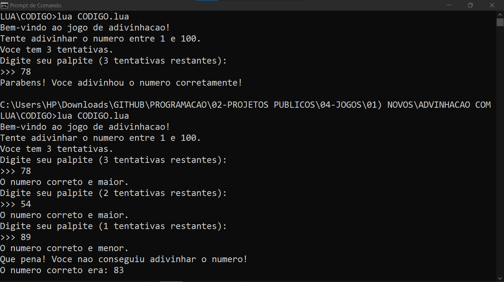

# ADVINHACAO COM LUA
👨‍💻ESSE É PEQUENO JOGO QUE RODA NO CONSOLE DA IDE.

 <br>

## DESCRIÇÃO:
Este é um jogo simples de adivinhação onde o jogador deve tentar adivinhar um número secreto gerado aleatoriamente entre 1 e 100. O jogador tem um total de 3 tentativas para descobrir o número correto. Após cada tentativa, o jogo fornecerá dicas sobre se o número correto é maior ou menor do que o palpite dado. O objetivo é adivinhar o número correto dentro do limite de tentativas.

## EXECUTANDO O JOGO:
1. Execute o código em um ambiente Lua com o comando:
   ```bash
   lua CODIGO.lua
   ```

2. **Início do Jogo:**
   - Ao iniciar o jogo, você será recebido com uma mensagem de boas-vindas e instruções sobre como jogar.

3. **Regras do Jogo:**
   - O jogo gera um número aleatório entre 1 e 100 que o jogador precisa adivinhar.
   - O jogador tem um máximo de 3 tentativas para adivinhar o número correto.

4. **Fazendo um Palpite:**
   - O jogo solicitará que você insira um palpite. O prompt `>>>` aparecerá na tela para indicar onde você deve digitar o número.
   - Após digitar o número e pressionar Enter, o jogo informará se o número correto é maior ou menor do que o seu palpite.

5. **Respostas do Jogo:**
   - Se o palpite estiver correto, você receberá uma mensagem de parabéns e o jogo terminará.
   - Se o palpite estiver incorreto, o jogo informará se o número correto é maior ou menor e permitirá uma nova tentativa, diminuindo o número de tentativas restantes.

6. **Fim do Jogo:**
   - O jogo termina quando o jogador adivinha o número corretamente ou quando o número de tentativas chega a 0.
   - Se o jogador esgotar todas as tentativas sem adivinhar o número, o jogo revelará o número correto e informará que o jogador não conseguiu adivinhar.

## NÃO SABE?
- Entendemos que para manipular arquivos em muitas linguagens e tecnologias, é necessário possuir conhecimento nessas áreas. Para auxiliar nesse aprendizado, oferecemos cursos gratuitos disponíveis:
* [CURSO DE LUA](https://github.com/VILHALVA/CURSO-DE-LUA)
* [CONFIRA MAIS CURSOS](https://github.com/VILHALVA?tab=repositories&q=+topic:CURSO)

## CREDITOS:
- [PROJETO CRIADO PELO VILHALVA](https://github.com/VILHALVA)
